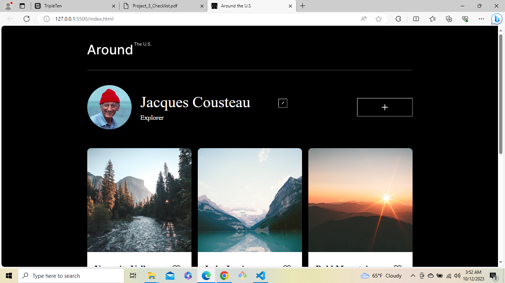
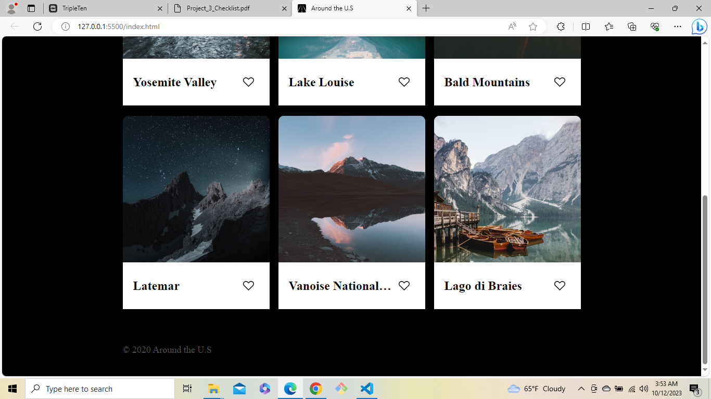
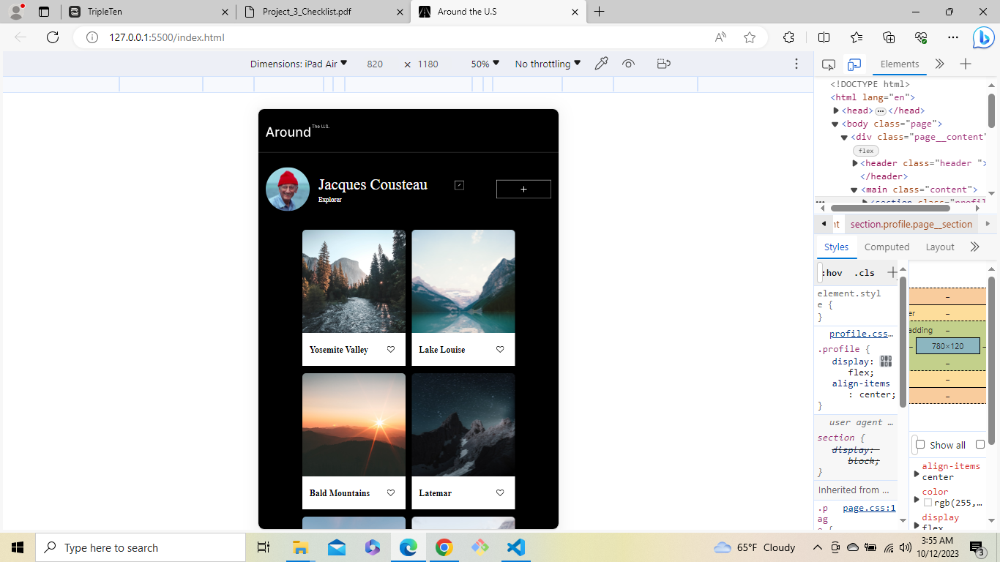
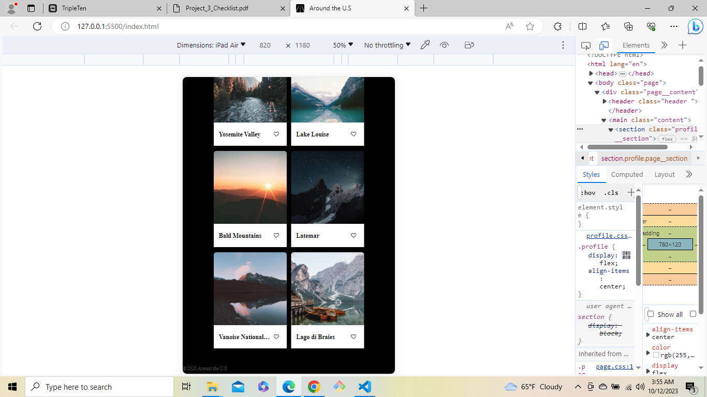
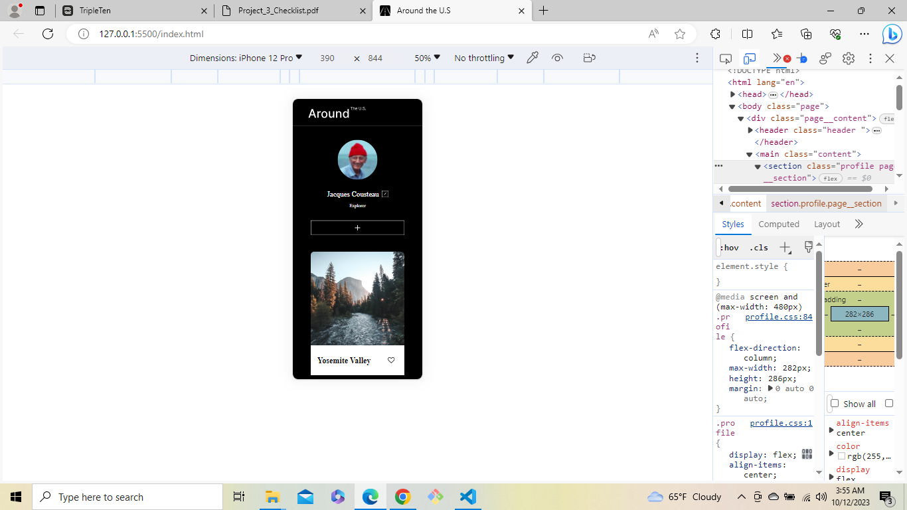
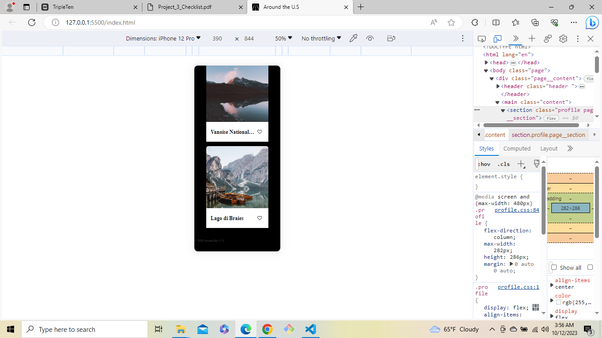

# Project 3: 
Around The U.S.

# Description:
Instagram like page where you can post images of your travels for evryone to see.

# Techniques Used
In thi sproject we focused on learning how to implement display:grid and how to change how the webpage looks on different devices.

# Screenshots on different sized screens
Desktop size   
Tablet size  
Phone size   

# Link to gitHub
https://github.com/marlondavid98/se_project_aroundtheus